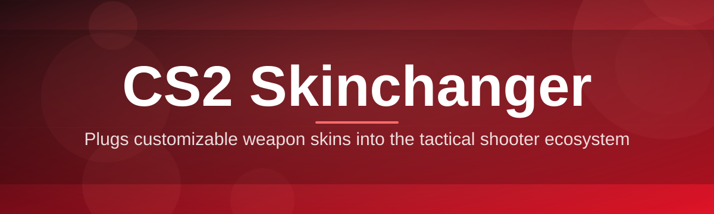

# cs2-skin-editor 🎨🔫

  

*Repaint your loadout, not your wallet — a standalone CS2 skin editor built for people who love the game's aesthetics.*

  

---

## 🧬 Overview

CS2's economy is built on scarcity — rare finishes, float values, StatTrak counters — and that scarcity is exactly why so many players never get to see how their favorite weapons look in a different finish. **cs2-skin-editor** exists to close that gap. It's a lightweight, standalone Windows application that lets you preview and apply skin configurations locally, giving you a personal sandbox to experiment with finishes, patterns, and wear levels without touching your inventory or the marketplace.

This project sits in the CS2 skinchanger space, but it's built with a different philosophy: transparency over obscurity. Every configuration is human-readable, every change is local, and nothing reaches outside your machine unless you tell it to. Whether you're a competitive player curious about a Dragon Lore's animated pattern, a content creator who needs consistent visuals for a video, or a developer studying how CS2 handles item definitions — this tool is built for you.

We wrote this for the community that spends more time in the inspect menu than in matchmaking. If you've ever alt-tabbed to check a skin's float value just to admire it, you already understand the itch this project scratches. 🖌️

> [!NOTE]
> This tool operates entirely offline against local configuration files. It does not interact with Valve's servers, your Steam inventory, or any marketplace.

---

## 🚀 What It Actually Does

1. **Live preview canvas** — spin your weapon in 3D as you swap finishes, no round restart required.

2. **Float & pattern control** — dial in wear values and pattern seeds with sliders instead of guesswork.

3. **StatTrak & nametag simulation** — preview kill counters and custom nametags exactly as they'd render in-game.

4. **Preset library** — save loadouts as named profiles and jump between them in one click.

5. **Sticker layering** — stack up to four stickers per weapon with rotation and wear controls.

6. **Knife & glove support** — full coverage beyond rifles, including melee finishes and glove sets.

7. **Config export** — write your setup to a portable file you can back up or move between installs.

8. **Batch apply** — push a preset across an entire loadout (all rifles, all pistols) in a single action.

9. **Dark & light rendering modes** — match the editor's theme to your desktop instead of squinting at a mismatched window.

> [!TIP]
> Save frequently-used combinations as presets — switching loadouts between matches becomes a two-click habit instead of a five-minute rebuild.

---

## 🧭 Getting Started

1. Visit the landing page using the download button above.

2. Grab the latest standalone build — no installer wizard, no bundled extras.

3. Run the executable directly. Windows Defender SmartScreen may flag unsigned apps; choose **More info → Run anyway**.

4. Pick a weapon from the sidebar, browse finishes, and hit **Apply** to preview instantly.

> [!IMPORTANT]
> Always close CS2 before launching the editor. Reading or writing config files while the game process is active can cause file locks or partial writes.

---

## 💻 System Requirements

| Component | Requirement |
|---|---|
| OS | Windows 10 (64-bit) or Windows 11 |
| RAM | 4 GB minimum, 8 GB recommended |
| Disk | ~150 MB free space |
| Dependencies | None — fully standalone, no runtime installs |
| GPU | Any DirectX 11-capable card for the preview canvas |

---

## ⚙️ How It Works

The editor follows a simple read → modify → write loop, keeping everything local and reversible.

1. **Scan** — locates your CS2 installation and relevant item definition files.

2. **Load** — parses weapon, skin, and sticker data into an editable in-memory model.

3. **Edit** — you adjust finishes, floats, patterns, and stickers through the UI.

4. **Preview** — the 3D canvas re-renders your changes in real time.

5. **Apply** — confirmed changes are written back as a local config, ready for the next launch.

---

## 🩹 Troubleshooting

**Q: The editor opens but the 3D preview is a black rectangle.**
A: Update your GPU drivers — the preview canvas needs a current DirectX 11 driver to render finishes correctly.

**Q: Windows SmartScreen blocked the download.**
A: This is expected for unsigned indie tools. Click **More info → Run anyway** on the SmartScreen prompt.

**Q: My changes disappeared after a CS2 update.**
A: Valve occasionally restructures item definition files during patches. Re-scan your installation from the editor's settings menu.

**Q: Can I use this while spectating or in a replay?**
A: Yes — cosmetic changes render identically whether you're playing, spectating, or watching a demo.

**Q: The preset dropdown is empty after reinstalling.**
A: Presets live in a local export file. Re-import it from **Settings → Import Presets** after a fresh install.

**Q: Stickers overlap oddly on certain skins.**
A: Some finishes have non-standard UV maps — nudge the sticker rotation slider by a few degrees to fix alignment.

---

## 🎛️ Interface & Experience

Keyboard shortcuts

| Shortcut | Action |
|---|---|
| `Ctrl + S` | Save current preset |
| `Ctrl + O` | Open preset library |
| `Ctrl + R` | Reset weapon to default |
| `F` | Toggle float slider precision mode |
| `Space` | Rotate weapon in preview canvas |

- Two built-in themes: **Midnight** (dark) and **Chalk** (light), switchable from the settings gear.

- Adjustable UI scale for high-DPI displays.

- Optional **compact mode** collapses side panels for smaller screens.

> [!TIP]
> Hold `Shift` while dragging the float slider for fine-grained, decimal-precision adjustments.

---

## 🤝 Contributing & Community

We build this in the open, and pull requests are genuinely welcome.

- Found a bug? Open an issue with steps to reproduce.

- Have a feature idea? Start a discussion before submitting a large PR — it saves everyone rework.

- Code style follows standard formatting conventions; keep PRs focused and small.

> [!WARNING]
> Please don't submit configs or assets that redistribute copyrighted Valve content. Contributions should extend the tool's functionality, not bundle proprietary game files.

 

---

## 📜 License

Released under the [MIT License](LICENSE), 2026.

> Use it, fork it, remix it — just keep the license notice intact.

---

## ⚠️ Disclaimer

This project is an independent, fan-made tool and is not affiliated with, endorsed by, or associated with Valve Corporation. "Counter-Strike 2" and "CS2" are trademarks of Valve Corporation. Use at your own discretion and in accordance with the game's terms of service.

---

